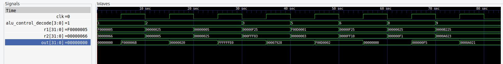

# RISCVerse64
*Aim*: The aim of this project is to design and implement a pipelined RISC-V 32-bit core with the Integer Base Instruction Set (RV32I).

# Introduction:
The RISC-V architecture is an open-standard instruction set architecture (ISA) adhering to established reduced instruction set computer (RISC) principles. This project specifically targets the 32-bit variant, RV32I. The "I" standard extension incorporates the integer instruction set, encompassing integer computational instructions, load/store instructions, and control flow instructions. The processor pipeline employs a five-stage design, consisting of fetch, decode, execute, memory access, and writeback stages.

# Methodology & Implementation:
The initial phase of the project involved designing hardware capable of executing the integer instructions outlined in the RV32I Base Integer Instruction Set. The design of a dedicated datapath for each instruction within the RV32I set was undertaken. This involved identifying the functional units required for each instruction and connecting them together. The individual datapaths were then combined to form the complete datapath. Additionally, a 5-stage pipelined architecture was adopted to enhance efficiency and throughput.

# Datapath Block Diagram of a simple 5-stage pipelined RISC processor

# Results:
Functional verification was conducted using module-specific testbenches for each pipeline stage, ensuring the correct operation of individual modules and their interactions. As of now, only a single core has been developed. Future plans include expanding functionality by adding M, F, and A extensions, and transitioning to a multicore design. 
Currently, thorough testing of R and I type instructions has been completed using Verilog testbenches in the Xilinx environment, with waveform analysis verified to validate their functionality.

Here's a plot showing the result of the operations: add, sub, sll, xor, srl, or, and 

# Conclusion:
By utilizing RISC-V principles and pipelining techniques, we've demonstrated improved throughput and performance. Our future efforts will focus on expanding functionality, transitioning to multicore designs, and optimizing the pipeline for efficiency. These steps aim to contribute to the ongoing evolution of processor architectures, meeting the demands of modern computing systems.

# References: 
[1] David A. Patterson and John L. Hennessy, *Computer Organization and Design: The Hardware/Software Interface: RISC-V Edition*, Elsevier, 2020.
[2] RISC-V Technical Specifications, *RISC-V Specifications*. [Online]. Available: https://riscv.org/technical/specifications/
[3] NPTEL Course, *Computer Architecture* by Prof. Madhu Mutyam. [Online]. Available: https://archive.nptel.ac.in/courses/106/106/106106134/
[4] RISC-V Documentation, *Shakti Documentation*. [Online]. Available: https://shakti.org.in/documentation.html

# Team Members
## Mentors:
Sanganabasu Herur (211EC245),
L Chandana (211EE235)

## Mentees:
Chinmayee Nagaraj (221EC212),
Suchet Nayak (221EE254)

## Acknowledgment: We extend our gratitude to Abhav S Velidi for his invaluable assistance throughout the design process.

*© 2024 RISC-V Core Implementation Team. All rights reserved.*
